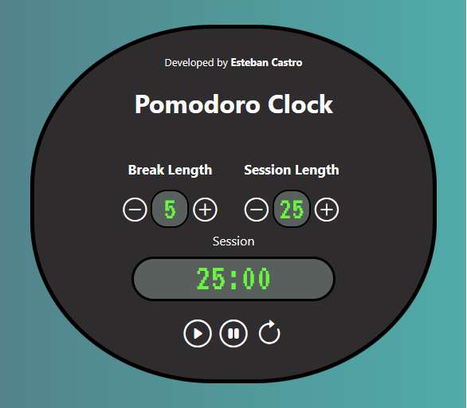

# Pomodoro Clock

Esta es una app de un reloj de sesiones de Pomodoro desarrollada en React. Esta aplicación es muy útil para organizar las rutinas de trabajo diarias de acuerdo a la metodología pomodoro, que consiste en 25 minutos de trabajo, por sesiones de 5 minutos de descanso. La aplicación es útil para desarrollar la lógica en JSX, mediante la asignación de estados con useState y el uso de otros hooks como useEffect, useRef además del uso de operadores ternarios 
y varios métodos clave de JavasCript.

## Características 

[Click para ver versión en vivo de la App](https://codepen.io/ecastroc/full/yLQKpBd)